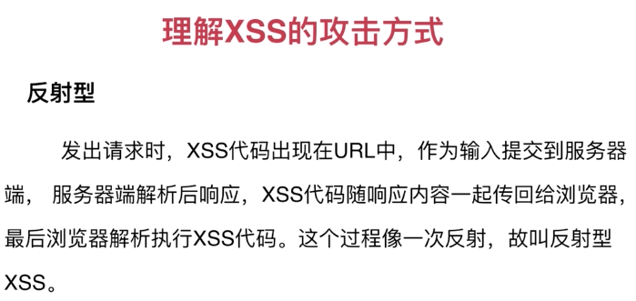
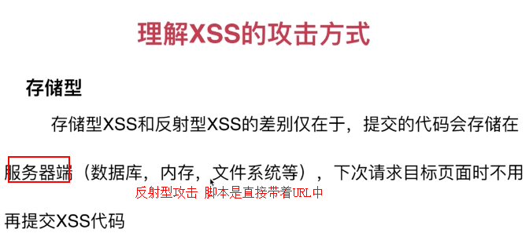

## XSS攻击与防御
> XSS攻击：跨站脚本攻击（Cross Site Scripting），为不和层叠样式表(Cascading Style Sheets, CSS)的缩写混淆。故将跨站脚本攻击缩写为XSS。XSS是一种经常出现在web应用中的计算机安全漏洞，它允许恶意web用户将代码植入到提供给其它 用户使用的页面中。比如这些代码包括HTML代码和客户端脚本。攻击者利用XSS漏洞旁路掉访问控制——例如同源策略（same origin policy）。这种类型的漏洞由于被骇客用来编写危害性更大的phishing攻击而变得广为人知。对于跨站脚本攻击，黑客界共识是：跨站脚本攻击是新 型的“缓冲区溢出攻击“，而JavaScript是新型的“ShellCode”。

在2007年OWASP所统计的所有安全威胁中，跨站脚本攻击占到了22%，高居所有Web威胁之首。
注：OWASP是世界上最知名的Web安全与数据库安全研究组织

#### XSS攻击的危害包括
1、盗取各类用户帐号，如机器登录帐号、用户网银帐号、各类管理员帐号
2、控制企业数据，包括读取、篡改、添加、删除企业敏感数据的能力
3、盗窃企业重要的具有商业价值的资料
4、非法转账
5、强制发送电子邮件
6、网站挂马
7、控制受害者机器向其它网站发起攻击

#### XSS漏洞的分类
XSS漏洞按照攻击利用手法的不同，有以下三种类型：

+ 类型A，本地利用漏洞，这种漏洞存在于页面中客户端脚本自身。

其攻击过程如下所示：

> Alice给Bob发送一个恶意构造了Web的URL。
Bob点击并查看了这个URL。
恶意页面中的JavaScript打开一个具有漏洞的HTML页面并将其安装在Bob电脑上。
具有漏洞的HTML页面包含了在Bob电脑本地域执行的JavaScript。
Alice的恶意脚本可以在Bob的电脑上执行Bob所持有的权限下的命令。

+ 类型B，反射式漏洞，这种漏洞和类型A有些类似，不同的是Web客户端使用Server端脚本生成页面为用户提供数据时，如果未经验证的用户数据被包含在页面中而未经HTML实体编码，客户端代码便能够注入到动态页面中。

其攻击过程如下：
> Alice经常浏览某个网站，此网站为Bob所拥有。Bob的站点运行Alice使用用户名/密码进行登录，并存储敏感信息（比如银行帐户信息）。
Charly发现Bob的站点包含反射性的XSS漏洞。
Charly编写一个利用漏洞的URL，并将其冒充为来自Bob的邮件发送给Alice。
Alice在登录到Bob的站点后，浏览Charly提供的URL。
嵌入到URL中的恶意脚本在Alice的浏览器中执行，就像它直接来自Bob的服务器一样。此脚本盗窃敏感信息（授权、信用卡、帐号信息等）然后在Alice完全不知情的情况下将这些信息发送到Charly的Web站点。
--代码--
> 搭建简单的express服务
```
express -e   用expres-cli工具生成一个简单的服务项目
npm install
npm start
打开浏览器 输入localhost:3000 即可见到express的欢迎页面
```

```
// 服务端
var express = require('express');
var router = express.Router();

/* GET home page. */
/* 反射型攻击方式： 服务端要解析请求参数，并写回客户端 */
router.get('/', function(req, res, next) {
    res.set('X-XSS-Protection', 0)      // 现代浏览器都自动屏蔽简单的xss， 这个设置表示不屏蔽
    res.render('index', { title: 'Express', xss: req.query.xss });
});
<!-- 客户端 -->
<!DOCTYPE html>
<html>
  <head>
    <title><%= title %></title>
    <link rel='stylesheet' href='/stylesheets/style.css' />
  </head>
  <body>
    <h1><%= title %></h1>
    <p>Welcome to <%= title %></p>
    <p>Welcome to <%- xss %></p>
  </body>
</html>
  <!-- 在浏览器输入以下内容 -->
  <!-- http://127.0.0.1:3000/?xss="" -->
  <!-- http://127.0.0.1:3000/?xss="<iframe src='//baidu.com/t.html'>" -->

```


+ 类型C，存储式漏洞，该类型是应用最为广泛而且有可能影响到Web服务器自身安全的漏洞，骇客将攻击脚本上传到Web服务器上，使得所有访问该页面的用户都面临信息泄漏的可能，其中也包括了Web服务器的管理员。

其攻击过程如下：
> Bob拥有一个Web站点，该站点允许用户发布信息/浏览已发布的信息。
Charly注意到Bob的站点具有类型C的XXS漏洞。
Charly发布一个热点信息，吸引其它用户纷纷阅读。
Bob或者是任何的其他人如Alice浏览该信息，其会话cookies或者其它信息将被Charly盗走。

类型A直接威胁用户个体，而类型B和类型C所威胁的对象都是企业级Web应用。
##### 示例代码
```
#服务端
/* 存储型攻击*/

// 用来缓存评论内容
var comments = {};

// 定义一个编码的函数
function html_encode (str) {
    var s ='';
    if (str.length==0) return s;
    s=str.replace(/&/g, '&gt;');
    s=str.replace(/</g, '&lt;');
    s=str.replace(/>/g, '&gt;');
    s=str.replace(/\s/g, '&nbps;');
    s=str.replace(/\'/g, '&#39;');
    s=str.replace(/\"/g, '&quot;');
    s=str.replace(/\n/g, '<br>');
    return s;
}
// 提交评论接口
router.get('/comment', function(req, res, next){
    // 编码后保存
    comments.v = html_encode(req.query.comment);
})
// 拉取评论接口
router.get('/getComment', function(req, res, next){
    // 编码后保存
    res.json({
        comment: comments.v
    })
})


# 客户端
<!DOCTYPE html>
<html>
  <head>
    <title><%= title %></title>
    <link rel='stylesheet' href='/stylesheets/style.css' />
    <script src="../javascripts/he.js"></script>
    <!-- https://github.com/mathiasbynens/he/blob/master/he.js -->
    <script src="../javascripts/htmlparser.js"></script>
    <!-- https://github.com/blowsie/Pure-JavaScript-HTML5-Parser/blob/master/htmlparser.js -->
    <script>
        /* 解码返回的结果   先反转义，然后对标签进行配对*/
        var parse = function (str) {
            var result = '';
            try {
                // 这个he对象来自于上面的he.js  用来解码（反转义） 用严格模式对str反转义
                var unescaped = he.unescape(str, {strict: true});
                // 这个方法来自于上面的htmlparser.js
                HTMLParser(unescaped, {
                    // tag：当前的标签名，attrs：标签的属性， unary：是否单标签
                    start: function (tag, attrs, unary) {
                        // 从源头过滤带有攻击功能的标签
                        if (tag == 'script' || tag == 'style' || tag == 'link' || tag == 'object'|| tag == 'iframe' || tag == 'frame' ) return;
                        result += '<' + tag;
                        for (var i = attrs.length - 1; i >= 0; i--) {
                            att = attrs[i].name
                            if (att.substr(0, 2) == 'on') {
                                result += ''
                            } else {
                                result += ' ' + att.name + '="' + att.escaped + '" '
                            }

                        }
                        result += unary ? '/>' : '>'
                    },
                    end: function (tag) {
                        result += '</' + tag + '>'
                    },
                    chars: function (text) {
                        result += text;
                    },
                    comment: function (text) {
                        result += '<!-- '+ text + ' -->'
                    }
                })
                return result;
            } catch (e) {
                console.error(e)
            }
        }

    </script>
  </head>
  <body>
    <h1><%= title %></h1>
    <p>Welcome to <%= title %></p>

    <textarea name="comment" id="txt" cols="30" rows="10">
        <p>来呀 造作啊 </p>
        <p> <script src="https://github.com/blowsie/Pure-JavaScript-HTML5-Parser/blob/master/htmlparser.js" onload="alert('加载好了')" onerror="alert(2333)">
        </script></p>
        <button onclick="alert('痒')">反正又大把时光， 点击我</button>
    </textarea>
    <hr>
    <button id="submit">提 交 评 论</button>
    <button id="get">获 取 评 论</button>

    <script>
        var txt = document.getElementById('txt')
        var submit = document.getElementById('submit')
        var get = document.getElementById('get')
        console.log('submit：', submit);
        console.log('get：', get);
        console.log('txt：', txt);
        submit.addEventListener('click', function () {
            var value = txt.value
            console.log('value:', value)
            ajax({
                url: '/comment?comment=' + value,
                method: 'GET',
                success: function (res) { alert('提交成功！')}
            })
        })
        // 获取评论
        get.addEventListener('click', function () {
            ajax({
                url: '/getComment',
                method: 'GET',
                success: function (resObj) {
                    // 拿到评论内容后 反转义-解析
                    var com = parse(resObj.comment)
                    var div = document.createElement('div')
                    // 这里要用innerHTML 让浏览器解析里面的html标签
                    div.innerHTML = com
                    document.body.appendChild(div)
                }
            })

        })
        function ajax (params) {
            var xhr = new XMLHttpRequest()
            xhr.open(params.method || 'GET', params.url, params.async || true)
            xhr.onreadystatechange = function () {
                if (xhr.readyState==4) {
                    if (xhr.status) {
                        var res = JSON.parse(xhr.response)
                        params.success && params.success(res)
                    } else {
                        params.error && params.error()
                        console.log('error')
                    }
                }
            }
            if (params.method && params.method.toLowerCase == 'post') {
                xhr.send(params.data)
            } else {
                xhr.send()
            }
        }
    </script>
  </body>
</html>
```
```
// 以上domparse过滤的地方还有很多其他可以处理的点
$ra1 = Array( 'javascript' , 'vbscript' , 'expression' , 'applet' , 'meta' , 'xml' , 'blink' , 'link' , 'style' , 'script' , 'embed' , 'object' , 'iframe' , 'frame' , 'frameset' , 'ilayer' , 'layer' , 'bgsound' , 'title' , 'base' );
$ra2 = Array( 'onabort' , 'onactivate' , 'onafterprint' , 'onafterupdate' , 'onbeforeactivate' , 'onbeforecopy' , 'onbeforecut' , 'onbeforedeactivate' , 'onbeforeeditfocus' , 'onbeforepaste' , 'onbeforeprint' , 'onbeforeunload' , 'onbeforeupdate' , 'onblur' , 'onbounce' , 'oncellchange' , 'onchange' , 'onclick' , 'oncontextmenu' , 'oncontrolselect' , 'oncopy' , 'oncut' , 'ondataavailable' , 'ondatasetchanged' , 'ondatasetcomplete' , 'ondblclick' , 'ondeactivate' , 'ondrag' , 'ondragend' , 'ondragenter' , 'ondragleave' , 'ondragover' , 'ondragstart' , 'ondrop' , 'onerror' , 'onerrorupdate' , 'onfilterchange' , 'onfinish' , 'onfocus' , 'onfocusin' , 'onfocusout' , 'onhelp' , 'onkeydown' , 'onkeypress' , 'onkeyup' , 'onlayoutcomplete' , 'onload' , 'onlosecapture' , 'onmousedown' , 'onmouseenter' , 'onmouseleave' , 'onmousemove' , 'onmouseout' , 'onmouseover' , 'onmouseup' , 'onmousewheel' , 'onmove' , 'onmoveend' , 'onmovestart' , 'onpaste' , 'onpropertychange' , 'onreadystatechange' , 'onreset' , 'onresize' , 'onresizeend' , 'onresizestart' , 'onrowenter' , 'onrowexit' , 'onrowsdelete' , 'onrowsinserted' , 'onscroll' , 'onselect' , 'onselectionchange' , 'onselectstart' , 'onstart' , 'onstop' , 'onsubmit' , 'onunload' );
```


#### XSS攻击原理及攻击方式
XSS又叫CSS (Cross Site Script) ，跨站脚本攻击。它指的是恶意攻击者往Web页面里插入恶意html代码，当用户浏览该页之时，嵌入其中Web里面的html代码会被执行，从而达到恶意用户的特殊目的。
